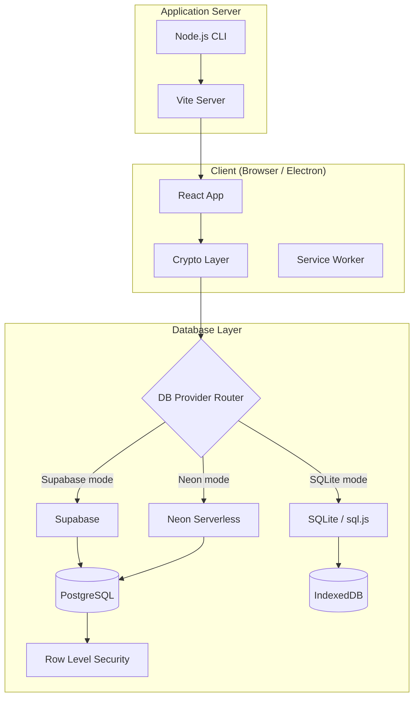
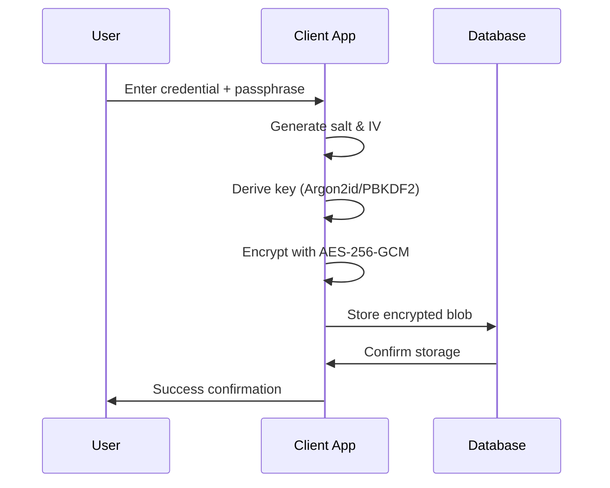

# 🔐 Keyper - Project Overview

<div align="center">


**✨ Modern Self-Hosted Credential Management with Client-Side Encryption ✨**

[](https://www.npmjs.com/package/@pinkpixel/keyper)
[](LICENSE)
[](https://reactjs.org/)
[](https://www.typescriptlang.org/)

_Dream it, Pixel it_ - **Made with ❤️ by Pink Pixel**

</div>

---

## 📋 Table of Contents

- [🎯 Project Purpose](#-project-purpose)
- [🏗️ Architecture Overview](#️-architecture-overview)
- [🔒 Security Implementation](#-security-implementation)
- [🛠️ Technology Stack](#️-technology-stack)
- [📁 Project Structure](#-project-structure)
- [🗄️ Database Schema](#️-database-schema)
- [🎨 User Interface](#-user-interface)
- [⚡ Performance Features](#-performance-features)
- [📱 Progressive Web App](#-progressive-web-app)
- [🚀 Deployment & Distribution](#-deployment--distribution)
- [🧪 Testing Strategy](#-testing-strategy)
- [📊 Current Status](#-current-status)
- [🔮 Future Roadmap](#-future-roadmap)

---

## 🎯 Project Purpose

**Keyper** is a modern, self-hosted credential management application designed to provide complete control over sensitive data. Secrets are encrypted in the browser under a key that is itself stored only wrapped under the user's master passphrase, so a database administrator holding a full dump cannot decrypt them. Credential *metadata* is a different matter and is stored in plaintext; see the limitations note under Security Implementation.

### Key Objectives

- 🔒 **Client-Side Encryption**: Secrets are encrypted before they leave the browser, under a key the server never holds in usable form
- 🏠 **Self-Hosted Control**: Complete data ownership and privacy
- 👤 **Multi-User Support**: Self-service registration, secure user switching, and isolated per-user vaults
- 📱 **Modern Experience**: Progressive Web App with native-like features
- 📄 **Secure Document Handling**: Encrypted document credential storage with metadata-aware detail UX
- ⚡ **High Performance**: Optimized loading and runtime performance
- 🎨 **Beautiful UI**: Glassmorphism design with accessibility in mind

---

## 🏗️ Architecture Overview

### System Architecture



### Core Design Principles

1. **Client-Side Encryption**: Encryption and decryption occur exclusively in the browser, and the master passphrase never leaves it
2. **Stateless Backend**: The database stores encrypted secrets, plaintext metadata, and a vault key that is useless without the passphrase
3. **User Isolation**: Enforced by the database through owner-scoped RLS, not by the client choosing to filter
4. **Progressive Enhancement**: Works offline with cached data
5. **Security First**: Multiple layers of protection and validation

---

## 🔒 Security Implementation

### Cryptographic Stack

| Component           | Implementation                           | Purpose                            |
| ------------------- | ---------------------------------------- | ---------------------------------- |
| **Key Derivation**  | Argon2id (preferred) / PBKDF2 (fallback) | Password-to-key transformation     |
| **Encryption**      | AES-256-GCM                              | Authenticated symmetric encryption |
| **Salt Generation** | Crypto.getRandomValues()                 | Unique salt per credential         |
| **IV Generation**   | Crypto.getRandomValues()                 | Unique initialization vector       |

### Security Features

- 🔐 **End-to-End Encryption**: All sensitive data encrypted before database storage
- 🔑 **Master Passphrase Protection**: Single passphrase controls vault access
- ⏰ **Auto-Lock**: 15-minute inactivity timeout with activity detection
- 🛡️ **Row Level Security**: Policies scoped `TO authenticated` with `owner_id = auth.uid()`, so the anon key alone reads nothing
- 👤 **Per-User Vault Isolation**: Enforced by the database via `owner_id`, not by client-side filtering
- 🚫 **No Admin Backdoors**: No recovery path for the master passphrase, because no value exists that could provide one
- ⚠️ **Metadata is plaintext**: Only `secret_blob` is encrypted; titles, usernames, URLs, notes and tags are readable by anyone with row access
- 🔒 **Content Security Policy**: Browser-level protection against XSS
- 🚫 **No Telemetry in App**: Zero tracking, telemetry, or data collection within the Keyper credential manager application itself. (The documentation website uses basic PostHog analytics to count total downloads and search query frequency).

### Encryption Workflow



---

## 🛠️ Technology Stack

### Frontend Technologies

| Technology       | Version | Purpose                                      |
| ---------------- | ------- | -------------------------------------------- |
| **React**        | 19.1.1  | Modern UI framework with concurrent features |
| **TypeScript**   | 5.8.3   | Type safety and developer experience         |
| **Vite**         | 7.0.6   | Lightning-fast build tool and dev server     |
| **Tailwind CSS** | 3.4.11  | Utility-first styling framework              |
| **Radix UI**     | Various | Unstyled, accessible UI primitives           |
| **shadcn/ui**    | Latest  | Pre-built component library                  |
| **Electron**     | 33.3.0  | Cross-platform desktop app runtime           |

### Backend & Database

| Technology         | Version | Purpose                                     |
| ------------------ | ------- | ------------------------------------------- |
| **Node.js**        | 18+     | Runtime for CLI and build tools             |
| **Supabase**       | 2.53.0  | Backend-as-a-Service platform (cloud mode)  |
| **Neon**           | 1.x     | Serverless Postgres provider (cloud/local)  |
| **PostgreSQL**     | 15+     | Relational database with advanced features  |
| **sql.js**         | 1.12.0  | SQLite compiled to WebAssembly (local mode) |
| **Docker / nginx** | 1.27+   | Containerised SPA serving                   |

### Security & Cryptography

| Library            | Purpose                                 |
| ------------------ | --------------------------------------- |
| **argon2-browser** | Memory-hard key derivation              |
| **Web Crypto API** | Browser-native cryptographic operations |
| **Zod**            | Runtime type validation                 |

### Development & Analytics Tools

| Tool          | Purpose                            |
| ------------- | ---------------------------------- |
| **ESLint**    | Code linting and quality           |
| **Vitest**    | Unit and integration testing       |
| **Wrangler**  | Cloudflare deployment              |
| **PostHog**   | Docs site usage & download metrics |

---

## 📁 Project Structure

```
keyper/
├── 📁 bin/                    # CLI executable
│   └── keyper.js             # Node.js server launcher
├── 📁 electron/               # Electron main-process source
│   ├── main.ts               # app:// protocol, security headers
│   ├── preload.ts            # context-bridge (window.keyperElectron)
│   └── tsconfig.json         # CommonJS TypeScript config
├── 📁 electron-dist/          # Compiled Electron output (git-ignored)
├── 📁 dist-electron/          # electron-builder output — installers (git-ignored)
├── 📄 electron-builder.yml    # Packager config (AppImage, deb, DMG)
├── 📄 Dockerfile              # Multi-stage Node→nginx image
├── 📄 nginx.conf              # SPA routing, WASM MIME, security headers
├── 📄 docker-compose.yml      # Single-command stack launch
├── 📁 docs/                   # Documentation
├── 📁 public/                 # Static assets
│   ├── logo.png              # Application logo
│   ├── favicon.ico           # Browser favicon
│   └── manifest.json         # PWA manifest
├── 📁 src/                    # Source code
│   ├── 📁 components/         # React components
│   │   ├── 📁 dashboard/      # Dashboard components
│   │   ├── 📁 ui/            # UI primitives
│   │   ├── PassphraseGate.tsx # Vault unlock component
│   │   ├── Settings.tsx       # Configuration interface
│   │   └── SelfHostedDashboard.tsx # Main app component
│   ├── 📁 crypto/             # Cryptography layer
│   │   ├── crypto.ts         # Core encryption functions
│   │   ├── encoding.ts       # Data encoding utilities
│   │   └── types.ts          # Crypto type definitions
│   ├── 📁 hooks/              # React hooks
│   ├── 📁 integrations/       # External service integrations
│   │   ├── 📁 supabase/       # Supabase client + provider router
│   │   └── 📁 database/       # SQLite and Neon provider adapters
│   ├── 📁 lib/                # Utility libraries
│   ├── 📁 pages/              # Route components
│   ├── 📁 security/           # Security utilities
│   ├── 📁 services/           # Business logic
│   └── 📁 types/              # TypeScript definitions
├── 📁 supabase/               # Database configuration
├── 📄 supabase-setup.sql      # Supabase/Postgres initialization script
├── 📄 neon-setup.sql          # Neon Postgres initialization script
├── 📄 package.json            # Project configuration
├── 📄 vite.config.ts          # Build configuration
├── 📄 tailwind.config.ts      # Styling configuration
├── 📄 README.md               # User documentation
├── 📄 SELF-HOSTING.md         # Deployment guide
├── 📄 CONTRIBUTING.md         # Contributor guide
└── 📄 LICENSE                 # Apache 2.0 license
```

---

## 🗄️ Database Schema

### Core Tables

#### **credentials**

Primary table for encrypted credential storage:

```sql
CREATE TABLE credentials (
  id UUID PRIMARY KEY DEFAULT gen_random_uuid(),
  user_id TEXT NOT NULL DEFAULT 'self-hosted-user',
  title TEXT NOT NULL,
  description TEXT,
  credential_type TEXT NOT NULL CHECK (credential_type IN ('api_key', 'login', 'secret', 'token', 'certificate', 'document', 'misc')),
  priority TEXT NOT NULL DEFAULT 'medium' CHECK (priority IN ('low', 'medium', 'high', 'critical')),
  username TEXT,
  url TEXT,
  tags TEXT[] DEFAULT '{}',
  category TEXT,
  notes TEXT,
  expires_at TIMESTAMP WITH TIME ZONE,
  last_accessed TIMESTAMP WITH TIME ZONE,
  created_at TIMESTAMP WITH TIME ZONE DEFAULT NOW(),
  updated_at TIMESTAMP WITH TIME ZONE DEFAULT NOW(),

  -- Encrypted storage
  secret_blob JSONB NOT NULL,
  encrypted_at TIMESTAMP WITH TIME ZONE DEFAULT NOW()
);
```

### Credential payload model (`secret_blob`)

Sensitive values are encrypted into `secret_blob` and are type-scoped in active add/edit flows:

- `login`: `password`
- `api_key`: `api_key`
- `secret`: `secret_value`
- `token`: `token_value`
- `certificate`: `certificate_data`
- `document`: `document_name`, `document_mime_type`, `document_content_base64`, `document_size_bytes`
- `misc`: `misc_value`

This prevents unrelated secret fields from leaking across credential types in detail views.

#### **vault_config**

Secure key management configuration with dual authentication systems:

````sql
CREATE TABLE vault_config (
  id UUID PRIMARY KEY DEFAULT gen_random_uuid(),

  -- Ownership. owner_id is the security boundary and what RLS scopes on.
  owner_id UUID NOT NULL DEFAULT auth.uid() REFERENCES auth.users(id) ON DELETE CASCADE,
  user_id TEXT NOT NULL DEFAULT 'self-hosted-user',  -- display label only

  -- The DEK, stored ONLY wrapped: AES-GCM encrypted under a key derived from
  -- the master passphrase with Argon2id or the recorded PBKDF2 fallback. There
  -- is no other copy and no verifier hash.
  wrapped_dek JSONB,

  created_at TIMESTAMP WITH TIME ZONE DEFAULT NOW(),
  updated_at TIMESTAMP WITH TIME ZONE DEFAULT NOW(),
  UNIQUE(owner_id)
);```

> **Removed in v1.3.0:** `raw_dek` held the DEK in directly usable form and
> `bcrypt_hash` held an offline-crackable hash of the master passphrase. Together
> with unconditional RLS policies, they meant anyone with the anon key could read
> the key that decrypts the vault. See `migration-auth-rls.sql`.

#### **categories**
Organization and categorization system:

```sql
CREATE TABLE categories (
  id UUID PRIMARY KEY DEFAULT gen_random_uuid(),
  user_id TEXT NOT NULL DEFAULT 'self-hosted-user',
  name TEXT NOT NULL,
  color TEXT DEFAULT '#6366f1',
  icon TEXT DEFAULT 'folder',
  description TEXT,
  created_at TIMESTAMP WITH TIME ZONE DEFAULT NOW(),
  updated_at TIMESTAMP WITH TIME ZONE DEFAULT NOW(),
  UNIQUE(user_id, name)
);
````

### Security Features

- ✅ **Row Level Security (RLS)** enabled *and enforced* on all tables
- ✅ **Owner-scoped policies** requiring an authenticated session, verified by `npm run test:rls` against a real Postgres
- ✅ **anon revoked** at the grant layer as well as by policy
- ✅ **Performance indexes** on frequently queried columns
- ✅ **Automatic triggers** for timestamp maintenance
- ✅ **Helper functions** for statistics and verification

The wrapped vault key records its KDF. Unlock always uses that recorded value,
so a PBKDF2 wrapper remains readable when another runtime supports Argon2id.
Keyper never substitutes one KDF for the other during decryption.

The Supabase connection test calls the read-only Auth settings endpoint. It
checks the project URL and publishable key without requesting protected table
data. Database grants and RLS can therefore stay closed to anonymous users.

---

## 🎨 User Interface

### Design System

- **Theme**: Light, dark, system, charcoal, medium gray, light gray, warm light, blue, midnight blue, and deep purple modes powered by `next-themes`
- **Dark surface**: The standard dark theme uses `#090909` instead of pure black
- **Colors**: CSS-variable palettes with semantic color coding and adaptive dashboard accents
- **Typography**: Inter, Roboto, Outfit, Playfair Display, and Fira Code application font choices stored as local preferences
- **Layout**: Responsive grid system with mobile-first approach
- **Accessibility**: ARIA labels, keyboard navigation, screen reader support

### Key Components

| Component             | Purpose                   | Features                                        |
| --------------------- | ------------------------- | ----------------------------------------------- |
| **PassphraseGate**    | Vault security checkpoint | Unlock flow + create-new-user entrypoint        |
| **UserRegistration**  | New account onboarding    | Username validation + passphrase confirmation   |
| **UserSwitcher**      | Multi-user controls       | Registered-user list + secure context switching |
| **DashboardSettings** | Settings shell            | Tabs: Users, Database, Passphrase, About, Appearance |
| **DatabaseConnectionCard** | Active connection    | Provider/endpoint readout + disconnect and reconfigure |
| **DatabaseSqlCard**   | Setup script              | Provider-matched SQL, copied straight from the repo files |
| **ChangePassphraseCard** | Master passphrase change | Requires the current one; re-wraps the vault key |
| **ResetVaultCard**    | Unrecoverable restart     | Explains why there is no reset; typed confirmation to delete |
| **DashboardHeader**   | Navigation and branding   | Search, user profile, actions                   |
| **CredentialsGrid**   | Main credential display   | Filtering, sorting, infinite scroll             |
| **CredentialModal**   | Detailed credential view  | Reveal, copy, edit, delete actions              |
| **SearchAndFilters**  | Advanced filtering system | Real-time search, tag filtering                 |

### Responsive Behavior

- **Mobile**: Touch-optimized interfaces, swipe gestures
- **Tablet**: Adaptive layouts, contextual toolbars
- **Desktop**: Full feature set, keyboard shortcuts
- **Large Screens**: Multi-column layouts, enhanced workflows

---

## ⚡ Performance Features

### Build Optimization

- **Code Splitting**: Automatic route and component chunking
- **Tree Shaking**: Dead code elimination
- **Asset Optimization**: Image compression and format selection
- **Bundle Analysis**: Chunk size monitoring and optimization

### Runtime Performance

- **Lazy Loading**: Deferred component loading
- **Memoization**: React.memo and useMemo optimization
- **Virtual Scrolling**: Efficient large list rendering
- **Caching**: Service Worker and HTTP caching strategies

### Cryptographic Performance

- **Argon2 Optimization**: Memory and CPU tuning
- **PBKDF2 Fallback**: Compatibility for older devices
- **Streaming Crypto**: Efficient handling of large datasets
- **Worker Threads**: Non-blocking encryption operations

---

## 📱 Progressive Web App

### PWA Features

- ✅ **Installable**: Add to home screen on all platforms
- ✅ **Offline Support**: Core functionality without internet
- ✅ **Push Notifications**: Security alerts and reminders
- ✅ **Background Sync**: Data synchronization when online
- ✅ **App Shell**: Fast loading with cached resources

### Service Worker Strategy

```javascript
// Workbox configuration
workbox: {
  globPatterns: ['**/*.{js,css,html,ico,png,svg}'],
  runtimeCaching: [
    {
      urlPattern: /^https:\/\/.*\.supabase\.co\/.*/i,
      handler: 'NetworkFirst',
      options: {
        cacheName: 'supabase-cache',
        expiration: {
          maxEntries: 10,
          maxAgeSeconds: 60 * 60 * 24 // 24 hours
        }
      }
    }
  ]
}
```

---

## 🚀 Deployment & Distribution

### Distribution Channels

1. **NPM Package**: Global installation via `npm install -g @pinkpixel/keyper`
2. **Direct Download**: Published desktop installers where available for the current release
3. **Docker Image**: Containerized deployment (nginx-based, production-ready)
4. **Cloud Deployment**: Cloudflare Pages, Netlify, Vercel support
5. **Electron Desktop App**: Native desktop packaging support, with published Windows and Linux installers for the current release

### CLI Integration

```bash
# Global installation
npm install -g @pinkpixel/keyper

# Quick start
keyper                    # Default port 4173
keyper --port 3000        # Custom port
keyper --help             # Show help
```

### Docker Deployment

```bash
# Clone and start with Docker Compose (default port 8080)
git clone https://github.com/pinkpixel-dev/keyper.git
cd keyper
docker compose up -d

# Custom port
HOST_PORT=3030 docker compose up -d

# Or run directly
docker build -t keyper .
docker run -d -p 8080:80 --name keyper --restart unless-stopped keyper
```

The container serves the compiled Vite/React SPA on port 80 internally. No Node.js or environment variables required on the host — all configuration (Supabase credentials, Neon connection strings, or SQLite provider selection) is entered in-app and stored in browser `localStorage`.

### Electron Desktop App

Current published installer links are available for Windows and Linux builds. Electron packaging also supports additional targets from source:

| Platform | Format          | Download                                                                                             |
| -------- | --------------- | ---------------------------------------------------------------------------------------------------- |
| Windows  | NSIS installer  | [KeyperSetup.v1.1.2.exe](https://pub-da847cd0fc1045b3a5a7fcc39a3be134.r2.dev/KeyperSetup.v1.1.2.exe) |
| Linux    | AppImage        | [Keyper-1.1.2.AppImage](https://pub-da847cd0fc1045b3a5a7fcc39a3be134.r2.dev/Keyper-1.1.2.AppImage)   |
| Linux    | `.deb` (x86_64) | [keyper_1.1.2_amd64.deb](https://pub-da847cd0fc1045b3a5a7fcc39a3be134.r2.dev/keyper_1.1.2_amd64.deb) |
| Linux    | `.deb` (ARM64)  | [keyper_1.1.2_arm64.deb](https://pub-da847cd0fc1045b3a5a7fcc39a3be134.r2.dev/keyper_1.1.2_arm64.deb) |

| Platform | Format   | Architecture  |
| -------- | -------- | ------------- |
| Windows  | NSIS     | x64           |
| Linux    | AppImage | x86_64, ARM64 |
| Linux    | `.deb`   | x86_64, ARM64 |

To build the currently documented desktop installers from source:

```bash
npm run electron:build:linux   # AppImage + deb
npm run electron:build:win     # NSIS / Windows build tooling required
```

### Self-Hosting Options

- **Local Network**: Internal company deployment
- **Cloud VPS**: DigitalOcean, AWS, Google Cloud
- **Edge Networks**: Cloudflare Workers/Pages
- **Container Platforms**: Docker, Kubernetes

---

## 🧪 Testing Strategy

### Test Coverage

- **GitHub Actions**: Automated testing on PRs
- **Build Verification**: Cross-platform compatibility
- **Security Scanning**: Dependency vulnerability checks
- **Performance Monitoring**: Bundle size tracking

---

## 📊 Current Status

### Version Information

- **Current Version**: 1.3.1
- **Release Date**: August 2026
- **Last Updated**: August 2026
- **Status**: Stable Production Release 🟢
- **License**: Apache 2.0
  | **User Interface** | ✅ Complete | Full responsive design |
  | **Database Layer** | ✅ Complete | Supabase + Neon + SQLite provider routing |
  | **SQLite Support** | ✅ Complete | Local-first, zero-config (browser/PWA + Electron) |
  | **PWA Features** | ✅ Complete | Full offline support |
  | **CLI Tools** | ✅ Complete | Multi-platform support |
  | **Docker Build** | ✅ Complete | nginx-based container |
  | **Desktop App** | ✅ Complete | Electron v33, all platforms |
  | **Documentation** | ✅ Complete | Comprehensive guides |

### Known Limitations

- **Mobile Biometrics**: Planned for a future release
- **Team Sharing**: Enterprise feature roadmap
- **API Access**: External integration support
- **Audit Logging**: Enhanced security tracking

---

## 🔮 Future Roadmap

### Version 1.2 (Next)

- 🔐 **Biometric Authentication**: Touch/Face ID support
- 📊 **Enhanced Analytics**: Usage patterns and insights
- 🔄 **Automatic Backups**: Encrypted cloud backup options
- 🚀 **Performance Optimizations**: Further speed improvements

### Version 1.2 (Q1 2026)

- 👥 **Team Collaboration**: Secure credential sharing
- 🔗 **External Integrations**: API access and webhooks
- 📱 **Native Mobile Apps**: iOS and Android applications
- 🛡️ **Advanced Security**: Hardware key support

### Version 2.0 (Q2 2026)

- 🏢 **Enterprise Features**: SSO, LDAP integration
- 🔍 **Advanced Audit**: Comprehensive logging and compliance
- 🌐 **Multi-Instance**: Federated deployment support
- 🤖 **AI-Powered**: Smart categorization and security insights

---

## 🤝 Contributing

Keyper is an open-source project welcoming contributions from developers worldwide. Please refer to [CONTRIBUTING.md](CONTRIBUTING.md) for detailed guidelines.

### Development Setup

```bash
git clone https://github.com/pinkpixel-dev/keyper.git
cd keyper
npm install
npm run dev
```

### Contribution Areas

- 🐛 **Bug Reports**: Help improve stability
- ✨ **Feature Requests**: Suggest new capabilities
- 📝 **Documentation**: Enhance user guides
- 🔐 **Security**: Cryptographic improvements
- 🎨 **Design**: UI/UX enhancements

---

## 📞 Support & Community

- 🌐 **Website**: [pinkpixel.dev](https://pinkpixel.dev)
- 📧 **Email**: [admin@pinkpixel.dev](mailto:admin@pinkpixel.dev)
- 💬 **Discord**: @sizzlebop
- 🐛 **Issues**: [GitHub Issues](https://github.com/pinkpixel-dev/keyper/issues)
- ☕ **Support**: [Buy me a coffee](https://www.buymeacoffee.com/pinkpixel)

---

<div align="center">

**⭐ Star this project if it helps secure your digital life! ⭐**

_Made with ❤️ by Pink Pixel - Dream it, Pixel it ✨_

</div>
